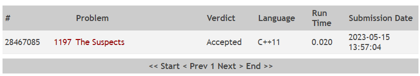

Questão do site [Online Judge](https://onlinejudge.org/) com identificação 1197

O problema consistia em indicar um grupo de suspeitos de uma doença respiratoria, para evitar uma maior disseminação.

Foi utilizado uma UFDS para identificar os grupos de pessoas, unindo os diversos grupos e retornando o total de suspeitos.

