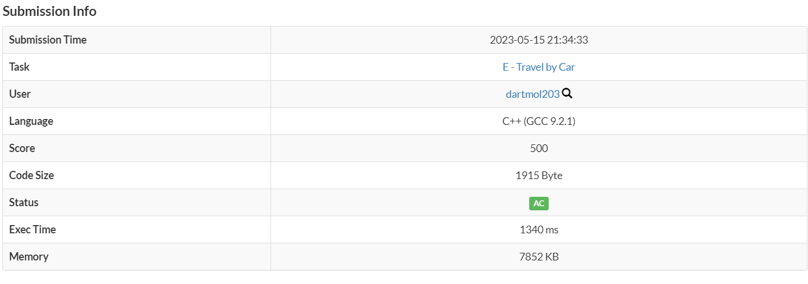

Questão do site [AtCoder](https://atcoder.jp/) do contest ABC 143 letra E

O problema consistia em encontrar quantas vezes precisaria abastecer o carro para se chegar em diversas cidades e se era possível.

Foi utilizado o dijkstra para identificar os caminhos, considerando o tamanho do tanque de gasolina do carro.

